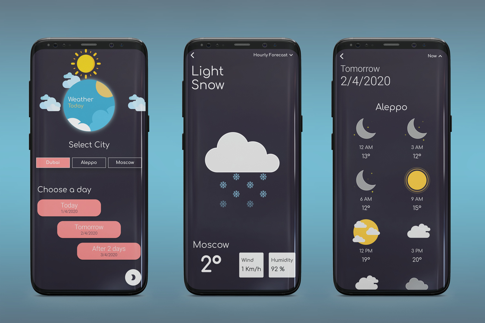
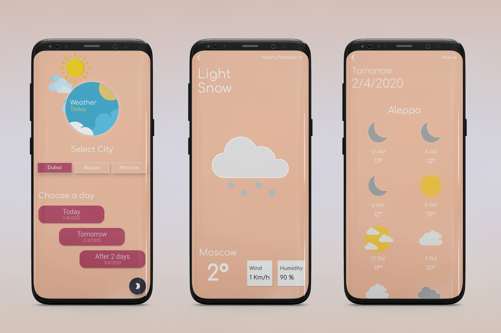

# Weather Today

This app will help you to keep update with daily weather forecasts.

## Features
- Weather forecasts for multiple cities (Dubai - Aleppo - Moscow)
- 3 Days weather forecasts for each city.
- Hourly weather forecast for each day.
- Weather forecasts cached using (Shared Preferences)
- State Management using Bloc pattern to fetch weather forecasts.
- Flare animation used in weather conditions,home page and splash screen
- Dynamic Theming (Light Mode - Dark Mode)

## Download App
- [Android Version](http://majd-kazmoz.tech/Weather%20Today.apk)

## Screenshots

### Dark mode

### Light Mode

## Flare Animations
- Created with [Rive](http://rive.app)
- My Account on rive: [Majd.kazmoz](https://rive.app/a/MajdKazmoz)
- Animation used in  [Splash Screen](https://rive.app/a/MajdKazmoz/files/flare/splash-screen-weather-app/preview)
- Animation used in  [Home Page](https://rive.app/a/MajdKazmoz/files/flare/home-page-weather-app/preview)
- Animation used in  [Weather Conditions](https://rive.app/a/MajdKazmoz/files/flare/weather-conditions/preview)
